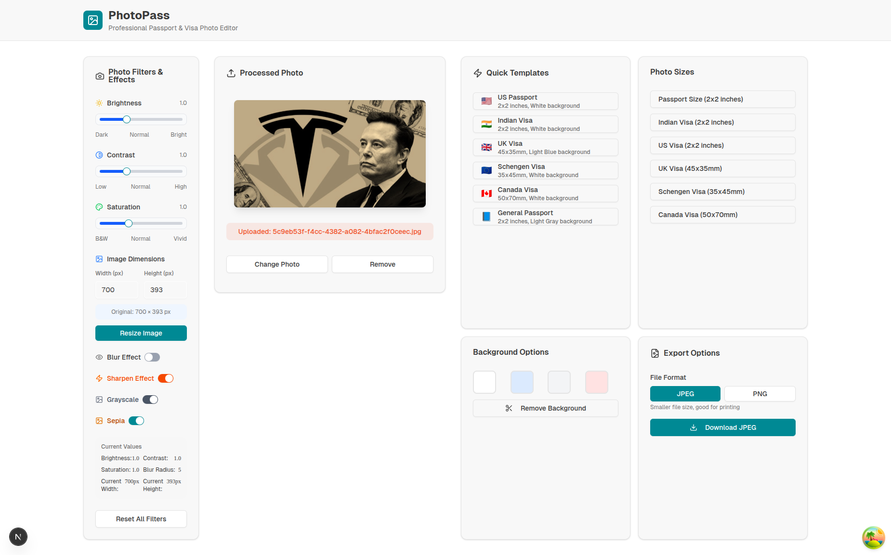
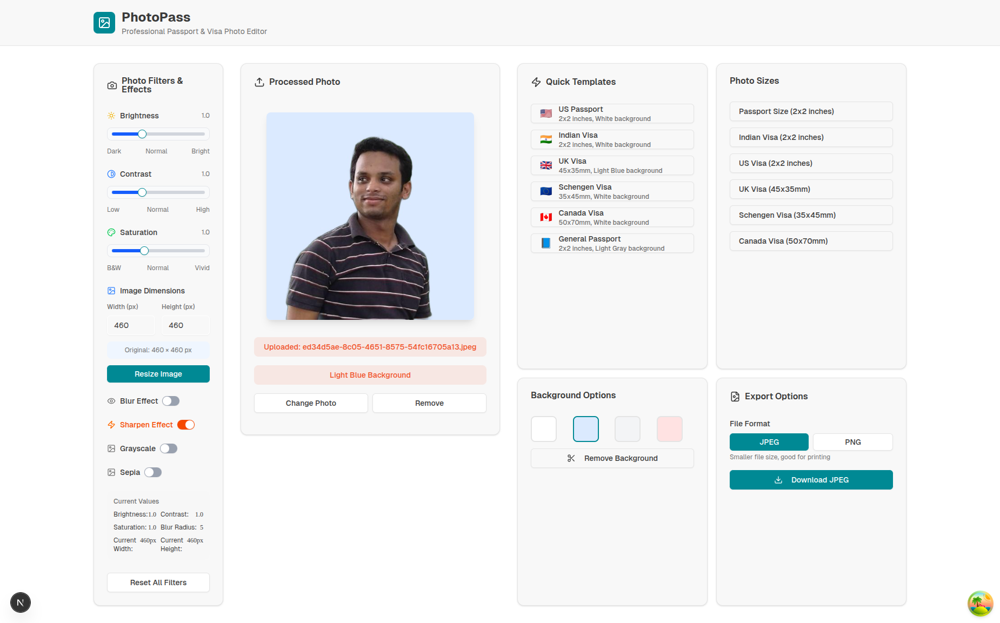

# PhotoPass 📸

A professional passport and visa photo editor built with modern web technologies. PhotoPass allows users to upload photos, apply preset templates for different countries, change backgrounds, resize images, apply professional photo filters and effects, and download processed photos in various formats.

## ✨ Features

### Core Functionality
- **Photo Upload**: Drag & drop or click to upload images
- **Preset Templates**: Quick templates for US, UK, Indian, Schengen, and Canadian visas
- **Background Changes**: Multiple background color options (White, Light Blue, Light Gray, Light Red)
- **Image Resizing**: Standard passport and visa photo dimensions
- **Multiple Formats**: Export in JPEG or PNG
- **Real-time Processing**: Server-side image processing with React Query
- **Responsive Design**: Works on desktop and mobile devices

### 🎨 Advanced Photo Filters & Effects
- **Brightness Control**: Adjust image brightness (0.1x to 3.0x)
- **Contrast Control**: Enhance light/dark differences (0.1x to 3.0x)
- **Saturation Control**: Control color intensity (0.0x to 3.0x)
- **Blur Effect**: Apply configurable blur with radius control (1-20px)
- **Sharpen Effect**: Enhance image details and clarity
- **Grayscale Conversion**: Convert photos to black and white
- **Sepia Effect**: Apply vintage warm-tone filter
- **Custom Dimensions**: Manual width/height input with auto-population
- **Real-time Preview**: See filter effects applied immediately

### 🖼️ Image Processing
- **Automatic Dimension Detection**: Shows current image dimensions in pixels
- **Custom Resizing**: Resize to any custom dimensions
- **Background Removal**: Remove existing backgrounds
- **Template Presets**: One-click application of country-specific requirements
- **Batch Processing**: Apply multiple effects sequentially

## 📸 Screenshots

### Photo Filters & Effects

*Comprehensive photo editing interface with sliders, toggles, and dimension controls*

### Background Change Feature

*Easy background customization with multiple color options*

## 🚀 Tech Stack

### Frontend
- **Next.js 15** - React framework with App Router
- **React 19** - Modern React with hooks
- **TypeScript** - Type-safe development
- **Tailwind CSS** - Utility-first CSS framework
- **React Query (TanStack Query)** - Server state management
- **Axios** - HTTP client for API requests
- **Lucide React** - Beautiful icons
- **Sonner** - Toast notifications
- **Radix UI** - Accessible UI components (Slider, Switch, Tooltip, etc.)

### Backend
- **FastAPI** - Modern Python web framework
- **Pillow (PIL)** - Image processing and enhancement
- **Pydantic** - Data validation and serialization
- **Uvicorn** - ASGI server

## 🛠️ Prerequisites

- **Node.js** (v18 or higher)
- **Python** (v3.8 or higher)
- **npm** or **pnpm** package manager

## 🚀 Quick Start

### 1. Clone the Repository

```bash
git clone https://github.com/manjurulhoque/photo-pass.git
cd photo-pass
```

### 2. Backend Setup

```bash
cd backend
python -m venv venv
source venv/bin/activate  # On Windows: venv\Scripts\activate
pip install -r requirements.txt
cp env.example .env
python main.py
```

### 3. Frontend Setup

```bash
cd frontend
npm install
cp env.example .env.local
npm run dev
```

## 🔧 Configuration

### Backend (.env)
```bash
API_V1_STR=/api/v1
MAX_FILE_SIZE=10485760
UPLOAD_DIR=uploads
PROCESSED_DIR=processed
SUPPORTED_FORMATS=[".jpg", ".jpeg", ".png", ".webp"]
```

### Frontend (.env.local)
```bash
NEXT_PUBLIC_API_URL=http://localhost:8000
```

## 📖 API Documentation

### Core Endpoints
- **POST** `/api/v1/upload` - Upload image
- **POST** `/api/v1/change-background` - Change background color
- **POST** `/api/v1/resize` - Resize image to specific dimensions

### Photo Filters & Effects
- **POST** `/api/v1/brightness` - Adjust brightness
- **POST** `/api/v1/contrast` - Adjust contrast
- **POST** `/api/v1/saturation` - Adjust saturation
- **POST** `/api/v1/blur` - Apply blur effect
- **POST** `/api/v1/sharpen` - Apply sharpening
- **POST** `/api/v1/grayscale` - Convert to grayscale
- **POST** `/api/v1/sepia` - Apply sepia effect

### Additional Features
- **GET** `/api/v1/list` - List uploaded images
- **DELETE** `/api/v1/delete/{filename}` - Delete image
- **Swagger UI**: http://localhost:8000/docs
- **ReDoc**: http://localhost:8000/redoc

## 🎯 Usage Guide

### Basic Photo Editing
1. **Upload Photo**: Drag & drop or click to upload an image
2. **Apply Templates**: Choose from preset country-specific templates
3. **Customize Background**: Select from multiple background colors
4. **Download**: Export in JPEG or PNG format

### Advanced Photo Filters
1. **Adjust Basic Settings**: Use sliders for brightness, contrast, and saturation
2. **Apply Effects**: Toggle on/off blur, sharpen, grayscale, or sepia effects
3. **Fine-tune**: Adjust blur radius when blur effect is active
4. **Custom Dimensions**: Enter custom width/height values for resizing
5. **Real-time Preview**: See all changes applied immediately

### Professional Workflow
1. **Upload**: Start with your original photo
2. **Enhance**: Apply filters to improve quality and appearance
3. **Resize**: Adjust to required dimensions for your application
4. **Background**: Change or remove background as needed
5. **Export**: Download the final processed image

## 🧪 Development

```bash
# Frontend
npm run dev
npm run build
npm run lint

# Backend
uvicorn main:app --reload --host 0.0.0.0 --port 8000
# or
make run
```

## 🏗️ Project Structure

```
photo-pass/
├── backend/
│   ├── app/
│   │   ├── routers/          # API endpoints
│   │   ├── schemas/          # Data models
│   │   └── services/         # Business logic
│   ├── main.py              # FastAPI application
│   └── requirements.txt     # Python dependencies
├── frontend/
│   ├── components/          # React components
│   │   ├── photo-editor-enhanced.tsx    # Main editor
│   │   └── photo-filters.tsx            # Filters & effects
│   ├── hooks/               # Custom React hooks
│   ├── lib/                 # Utility functions
│   └── package.json         # Node.js dependencies
└── screenshots/             # Application screenshots
```

## 🔍 Key Components

### PhotoEditorEnhanced
- Main photo editing interface
- 3-column layout (Filters, Image, Templates)
- Drag & drop file upload
- Template presets and background options

### PhotoFilters
- Comprehensive filter controls
- Real-time slider adjustments
- Effect toggles with visual feedback
- Custom dimension inputs
- Current values display

## 📝 Contributing

1. Fork the repository
2. Create a feature branch (`git checkout -b feature/amazing-feature`)
3. Commit your changes (`git commit -m 'Add amazing feature'`)
4. Push to the branch (`git push origin feature/amazing-feature`)
5. Open a Pull Request

## 🎨 Design Principles

- **User-Centric**: Intuitive controls for both beginners and professionals
- **Real-time Feedback**: Immediate visual results for all operations
- **Accessibility**: Proper labels, tooltips, and keyboard navigation
- **Responsive**: Works seamlessly across all device sizes
- **Performance**: Efficient image processing with progress indicators

## 🚀 Future Enhancements

- Filter presets (Portrait, Landscape, Vintage)
- Before/after comparison view
- Batch processing for multiple images
- Advanced AI-powered background removal
- Cloud storage integration
- Collaborative editing features

---

**Happy Photo Editing! 📸✨**

*PhotoPass - Professional photo editing made simple and powerful.*
